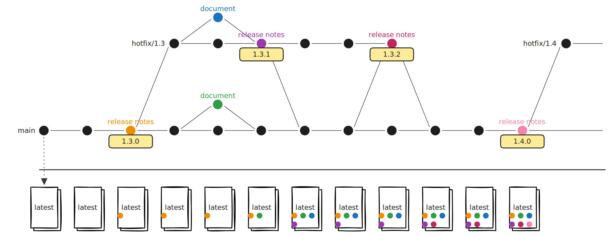
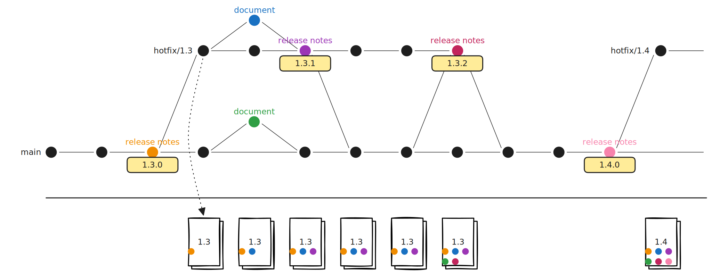

.. meta::
    :description: Explanation of the continuous deployment process for documentation in Starcraft projects

.. _explanation-continuous-deployment-documentation:

Continuous deployment for documentation
=======================================

This page explains the process of continuously deploying documentation updates in craft
apps and libraries.

Deployment process
------------------

We publish documentation through a process that rides on top of our software development
and release process.

Main
~~~~

ately until recombined in main.

All documentation changes in the repository's ``main`` branch are immediately deployed
to the ``latest`` documentation version on Read the Docs.

To make a documentation change for ``main``:

1. A contributor proposes a document.
2. Both technical authors review the document.
3. The CI checks run the documentation tests against the document. If the document derives from the product code, the CI runs the full test suite.
4. A technical author approves and merges the document.
5. Read the Docs publishes the updated docs to ``https://<site>/latest``

Releases
~~~~~~~~

stories, and publish separately until recombined in main.

All documentation changes in the release's hotfix branch are immediately deployed to the
corresponding documentation version on Read the Docs.

The documentation process is largely the same, with a few controls related to branching.
Let's take the minor version 1.3 in a product.

To release 1.3:

#. The main engineer merges any changes destined for the upcoming version.
#. The main engineer proposes the 1.3 release notes.
#. The CI checks run all tests against the release notes.
#. A technical author reviews and approves the release notes.
#. The main engineer merges the release notes.
#. The main engineer tags the commit of the release notes, signifying in the source code
   that the version is released.
#. The main engineer `builds the release on the farm
   <https://discourse.canonical.com/t/release-process/626#p-722-import-the-code-on-launchpad-5>`__.
#. The main engineer creates the ``hotfix/1.3`` branch.
#. On Read the Docs, the TA creates documentation version 1.3, sourced from the
   ``hotfix/1.3`` branch.
#. The TA redirects the prior minor documentation versions to documentation version 1.3.
#. Read the Docs publishes the new version for that release, at ``https://<site>/1.3``

To make a documentation change for 1.3:

#. A contributor proposes a document.
#. Both technical authors review the document.
#. The CI checks run the documentation tests against the document. If the document derives from the product code, the CI runs the full test suite.
#. A technical author approves and merges the document.
#. Read the Docs publishes the updated docs to ``https://<site>/1.3``

Key aspects of the process
~~~~~~~~~~~~~~~~~~~~~~~~~~

**Versioned documentation is deployed from hotfix branches.** The most important factor
in the process is that a version's docs are republished with every commit. Every commit
to the hotfix branch republishes the documentation. They *do not* *wait* for a new
release. That way, continuous improvement in the documentation is never delayed.

If the docs sit as a layer on top of the regular software release, why not merge to ``main`` and cherry pick changes, instead? First, because hotfix branches and ``main`` don't have feature parity. Some documentation derived from product code, like CLI references, have hard differences that can't be squashed. Second, the history between branches isn't always linear. Patches and fixes are ported forward *and* backward. Resolving these differences falls to the maintainers, and we don't want to burden them with more work rejoining branches.

**Technical authors approve and merge.** Documentation can only reach high velocity if
the review process is trim. Documentation is mechanically simple, and carries much less
risk than product code. Both benign and critical fixes in documents should be less
costly than a change to business logic like a new feature. Neither a correction to a
one-word typo nor a broken link deserve full engineering scrutiny. The technical authors
provide quality assurance and take responsibility for their own work, so this doesn't
reduce the contribution quality. They also judge when to ask engineers to provide
additional reviews, for complex or important documentation changes.

**Restricted tests for documents.** When a documentation change is proposed in a pull
request, the continuous integration system runs only the documentation checks and tests.
Documents are only implicated in the development test suite if they derive from the
product source.

Software needs
--------------

Developers and users expect packaged software to be long-lasting and stable. Frequent
and unpredictable releases give consumers the perception that the software is of low
quality, and is potentially disruptive. A careful approach, where software is released
infrequently and in predictable cadences, is best suited for packages. That's our
thinking behind how often and when we release our software.

To develop software stably and carefully, Starcraft projects practice the `OneFlow
<https://www.endoflineblog.com/oneflow-a-git-branching-model-and-workflow>`__ branch
style. In it, a Git tag signifies a software release, and supported releases are further
maintained inside long-lived hotfix branches. Hotfix branches protect concurrent
releases from regression because they separate the code into different channels. Since
creating a tag and spreading changes require a close understanding of the code and
manual action by the developer, these are suitable controls for our packaging mindset.

Documentation needs
-------------------

Each Starcraft project publishes its documentation to its own live, public website.
Websites and web technologies operate on different principles than atomic packages. They
are live services reachable at persistent addresses, their information must be
consistently accurate, and they must rarely, if ever, go offline for maintenance. This
means that for a given documentation site, readers expect the documentation to reliably
contain the latest and most accurate information available. It also means that fixes to
the site, to the documentation, shouldn't lag behind the software, and should never
require downtime.

The requirements between delivering atomic software packages and up-to-date
documentation are in tension with each other. Software must release as infrequently as
possible, while its documentation must be updated the moment its information is out of
date.

Deployment, not delivery
------------------------

We can say, then, that our software must provide **continuous delivery**, where it's
*capable* of deployment at any time with human intervention. Documentation, instead,
must practice **continuous deployment**, where every change to the documents *must* be
published automatically.

Results
-------

A good process benefits people. We want documentation deployment to be good for everyone
who uses, develops, and learns our software. Here are the particular results, written as
user statements, that we want it to provide.

Users
~~~~~

- When I go to ``<site>/latest``, I see the latest documents from the ``main`` branch.
- When I go to ``<site>/1.3``, I see the documents for version 1.3.
- If there's a correction to the documents for version 1.3, I see it immediately in
  ``https://<site>/1.3``.
- If there's a patch to version 1.3, the patch description is available at
  ``https://<site>/1.3``.

Contributors
~~~~~~~~~~~~

- When I open a PR with only documentation changes, the CI only runs the documentation
  checks.
- When reviewing my PR, I can expect that simple changes are merged within a week of
  approval by the technical authors.
- In product code, like the CLI strings, I can link to ``https://<site>/1.3``, and not
  worry about the patch number.

Engineers
~~~~~~~~~

- The process for deploying documentation is seamless and as automated as possible.
- The technical authors provide the majority of the documentation review for me.
- The technical authors can make small documentation fixes without my oversight.

Technical authors
~~~~~~~~~~~~~~~~~

- The CI system takes no more than ten minutes to build and test a documentation pull
  request.
- When a member of another team opens a documentation pull request, I can review and
  merge it in as little time as possible.
